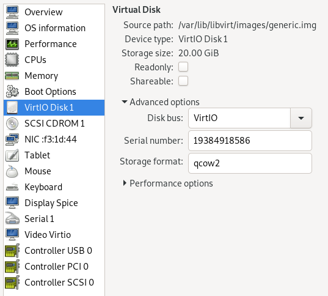

# Ubuntu Server Remote SSH Install

## 0. Important Information

This guide demonstrates how to reinstall a Linux server remotely only via a SSH connection. It is the first part of the Remote SSH Ubuntu Installation series. The same process will work for physical or virtual machines.

### Caution
* Backup your data. Any existing data may be lost.
* This guide focuses on legacy BIOS installations, UEFI installations require additional steps and partitions to function.

### 0.1 Why?

It is possible to find yourself in one the following situation:

- You have leased a dedicated server or a virtual machine in a data center. You do not have physical, VM console or remote console access(iDRAC/hILO/etc). The only options for a regular re-installation are via web administration console with a set of pre-prepared automated installations, disk formatting via restrictive options in web forms and perhaps many releases older than you wish to use.
- You may wish to install [Ubuntu Server on ZFS Root File System](ubuntu-server-19.10-zfs-root.md) where the version of ZFS are not directly available in the ISOs available to you.
- You do not trust the source ISOs and hosted custom kernels and wish to clear the system to a more trusted state. This won't completely disable all possible firmware based observations of your operating systems, but it should reduce the observability of your system with foreign kernels/monitoring packages.
- You have not upgraded your Ubuntu non-LTS distribution within the support window and you wish to reinstall your remote server with the ability of keeping your configuration and data around 
- You want to do something difficult and off the beaten track for a learning experience.

Whatever the reason, it is possible to complete a system re-installation via only an SSH connection.

### 0.2 Requirements

This guide will assume that the target server is running an older version of Ubuntu, this guide will use  a Ubuntu Server 16.04 LTS server as demonstration. It is possible to perform this re-installation on CentOS like systems using the `deboostrap` package as [outlined here](https://linuxconfig.org/how-to-debootstrap-on-centos-linux). The following assumptions are made:

1. Functioning server with remote SSH and root account access.
2. No full disk-encryption, it's not possible to enter the decryption password of a root partition via SSH only.
3. The server has a swap partition of 2GB or more, preferably at the end of the disk. This will be used as the target for a temporary installation. A basic installation of Ubuntu can make swap volumes as small as 1 GB, this will not be enough for this guide, the current requirements indicate that 1.5 GB should be sufficient.

A typical non-LVM partition schema is used in this guide. It should be possible to follow this guide using an LVM managed device, just keep in mind during partitioning that that steps to add/resize volume groups and volumes with LVM will be different to those in this guide.

### 0.3 Testing with a Virtual Machine

If trying out this method and for compatibility with the additional Ubuntu Root on ZFS guide using KVM/QEMU, best results are found using BIOS firmware instead of UEFI. It's possible to adopt this method using the UEFI approaches used elsewhere in other guides

Virtual Machine Manager is a graphical approach to testing this with KVM.

Install command:
```bash
apt-get install qemu virt-manager
```

*Note*: Working results were found using VirtIO drivers for disk, video and network. Other default/generic options may not work as expected.

**Important**: The virtual disk used for installation needs to have a serial number defined so that the disk device appears in the `/dev/disk/by-id/` directory. This ensures ZFS is able to locate the zpool devices correctly during boot of the system. If you are planning on using ZFS, configure it in the following way.




## 1: Prepare System for Temporary Installation of Ubuntu

In order to be able to repartition and format the existing partitions used by the current installation, a temporary installation onto the swap partition is required. This will allow booting of the server from the swap partition to complete the changes to the existing system volumes.

1.1 Login to the server

Connect to the remote server using SSH and elevate to a root prompt:
```bash
ssh username@server-addresss
sudo -i
```
1.2 Check the disk layout

1.2.1 Show the partition layout
```bash
fdisk -l
```
In a typical Ubuntu installation, the swap partition is created at the end of the disk which is a useful location for a temporary installation. It's pretty small in this instance at 1 GB, hopefully big enough for this process.
```
Disk /dev/vda: 40 GiB, 42949672960 bytes, 83886080 sectors
Units: sectors of 1 * 512 = 512 bytes
Sector size (logical/physical): 512 bytes / 512 bytes
I/O size (minimum/optimal): 512 bytes / 512 bytes
Disklabel type: dos
Disk identifier: 0x6ab261f7

Device     Boot    Start      End  Sectors  Size Id Type
/dev/vda1  *        2048 79884860 79882813 38.1G 83 Linux
/dev/vda2       79886334 83884031  3997698  1.9G  5 Extended
/dev/vda5       79886336 83884031  3997696  1.9G 82 Linux swap / Solaris
```
1.2.2 Check the swap status
```bash
swapon -s
```
The swap is currently online on the partition at the end of the disk
```bash
Filename           Type            Size     Used    Priority
/dev/vda5          partition       1998844  0       -1
```
1.3 Stop any large service/daemons to a mininal server state
```bash
docker stop mysql lychee
systemctl stop nginx docker postgresql
```
1.4 Disable swap
```bash
swapoff -a
swapon -s        # this should return no output
```
1.5 Change the swap partition to Linux type
```bash
fdisk -l         # confirm the device path of swap
fdisk /dev/vda   # launch fdisk on the disk device
t                # type t to change the partition type
5                # select the partition number to change
83               # change partition to Linux type
w                # write changes and exit fdisk
```
1.6 Format the swap partition as ext4
```bash
mkfs.ext4 -j /dev/vda5
y                # proceed even though the filesystem was swap
```
1.7 Mount the formated partition
```bash
mount /dev/vda5 /mnt
mount -l
```
The device should appear at the end of the `mount` command output
```
...
/dev/vda5 on /mnt type ext4 (rw,relatime,data=ordered)
```
## 2: Installing Ubuntu on Swap partition

2.1 Install debootstrap
If there is an OS other than Ubuntu/Debian on the server and the desire is to move to Ubuntu, find a method for installing `debootstrap` in the current distribution. Otherwise, install `debootstrap` using `apt`.
```
apt install --yes debootstrap
```
2.2 Install Ubuntu 19.10 (eoan)

This guide is targeting `eaon` for `zfs v0.80` support, this could be any other Ubuntu release that is currently supported.
```
/usr/sbin/debootstrap --arch amd64 eoan /mnt
```
## 3: Configure the Install

3.1 Configure hostname, change `ubuntu` to the desired name.
```bash
echo ubuntu > /mnt/etc/hostname
```

3.2 Add loopback (`127.0.0.1   hostname`) for hostname beneath localhost.
```bash
vi /mnt/etc/hosts
```

3.3 Configure Networking

**Important**: This configuration will be used on the first reboot of the server, if it's *not correct*, then it will not be possible to connect to the temporary install using SSH. Double check the configuration before proceeding past the networking configuration.

3.3.1 Get the interface name and configure netplan yaml.
```bash
# show ip address, default route gateway and dns server
ip addr show
route
dig www.google.com | grep SERVER 
```
Base on the output of the above commands, the network configuration for the system in this guide is as follows:
- Interface Name: `ens3`
- IP Address: `192.168.122.175` 
- Subnet: `/24`
- Default Gateway: `192.168.122.1`
- DNS Sever: `192.168.122.1`
```bash
2: ens3: <BROADCAST,MULTICAST,UP,LOWER_UP> mtu 1500 qdisc pfifo_fast state UP group default qlen 1000
    link/ether 52:54:00:07:8e:fa brd ff:ff:ff:ff:ff:ff
    inet 192.168.122.175/24 brd 192.168.122.255 scope global ens3
       valid_lft forever preferred_lft forever
    inet6 fe80::5054:ff:fe07:8efa/64 scope link 
       valid_lft forever preferred_lft forever
Kernel IP routing table
Destination     Gateway         Genmask         Flags Metric Ref    Use Iface
default         192.168.122.1   0.0.0.0         UG    0      0        0 ens3
192.168.122.0   *               255.255.255.0   U     0      0        0 ens3
;; SERVER: 192.168.122.1#53(192.168.122.1)
```
3.3.2 Configure netplan

Content may need to be configured with a static address depending on the existing system. Check the local netplan config for an existing server.
```
less /etc/netplan/01-netplan.yaml
```
If this config looks correct for the system, copy it to the new installation. Then jump to the `3.4 Apt Configuration` section.
```
cp /etc/netplan/01-netplan.yaml /mnt/etc/netplan/01-netplan.yaml
```
In this case of Ubuntu 16.04, the interface will be configured with the older `interfaces` method:
```
less /etc/netplan/01-netplan.yaml
```
Manual configuration of the netplan config
```bash
vi /mnt/etc/netplan/01-network.yaml
```
For a simple DHCP config, the contents would be:
```yaml
network:
  version: 2
  ethernets:
    ens3:
      dhcp4: true
```
A static address config will provide the parameters discovered above
```yaml
network:
  version: 2
  ethernets:
    ens3:
      dhcp4: no
      dhcp6: no
      addresses: [192.168.122.175/24]
      gateway4: 192.168.122.1
      nameservers:
        addresses: [192.168.122.1]
```

3.4 Configure `apt` sources. Remove any src/universe/multiverse/backports as desired. Change `eoan` to the target distribution. Change the `apt` mirror URLs to those geographically closest to the server.
```bash
vi /mnt/etc/apt/sources.list
```
Contents:
```yaml
deb http://au.archive.ubuntu.com/ubuntu/ eoan main restricted
deb-src http://au.archive.ubuntu.com/ubuntu/ eoan main restricted

deb http://au.archive.ubuntu.com/ubuntu/ eoan-updates main restricted
deb-src http://au.archive.ubuntu.com/ubuntu/ eoan-updates main restricted

deb http://au.archive.ubuntu.com/ubuntu/ eoan universe
deb-src http://au.archive.ubuntu.com/ubuntu/ eoan universe
deb http://au.archive.ubuntu.com/ubuntu/ eoan-updates universe
deb-src http://au.archive.ubuntu.com/ubuntu/ eoan-updates universe

deb http://au.archive.ubuntu.com/ubuntu/ eoan multiverse
deb-src http://au.archive.ubuntu.com/ubuntu/ eoan multiverse
deb http://au.archive.ubuntu.com/ubuntu/ eoan-updates multiverse
deb-src http://au.archive.ubuntu.com/ubuntu/ eoan-updates multiverse

deb http://au.archive.ubuntu.com/ubuntu/ eoan-backports main restricted universe multiverse
deb-src http://au.archive.ubuntu.com/ubuntu/ eoan-backports main restricted universe multiverse

deb http://security.ubuntu.com/ubuntu eoan-security main restricted
deb-src http://security.ubuntu.com/ubuntu eoan-security main restricted
deb http://security.ubuntu.com/ubuntu eoan-security universe
deb-src http://security.ubuntu.com/ubuntu eoan-security universe
deb http://security.ubuntu.com/ubuntu eoan-security multiverse
deb-src http://security.ubuntu.com/ubuntu eoan-security multiverse
```

3.5 **Optional**: Copy terminfo if you're using a different terminal emulator such as kitty at this point:
```
cp -r ~/.terminfo/ /mnt/root/
```

## 4. Configure Basic System

To configure the installation, enter the installation environment by using `chroot` to emulate the new `root` mount.

4.1 Enter chroot.
```bash
mount --rbind --make-rslave /dev  /mnt/dev
mount --rbind --make-rslave /proc /mnt/proc
mount --rbind --make-rslave /sys  /mnt/sys
chroot /mnt /bin/bash --login
```

4.2 Import Environment
```bash
source /etc/environment
```
4.3 Populate the `apt` cache.
```bash
apt update
```
4.4 Configure locales and timezone as required
```bash
locale-gen --purge "en_AU.UTF-8"
update-locale LANG=en_AU.UTF-8 LANGUAGE=en_AU
dpkg-reconfigure --frontend noninteractive locales
dpkg-reconfigure tzdata
```
4.5 Install generic kernel
```bash
apt install --yes linux-image-generic
```
When prompted, install grub to the disk device only, in this guides example `/dev/vda`.

4.6 Configure fstab

Change `/dev/vda5` to the partition used to mount in Step `1.7`
```
cat > /etc/fstab << "EOF"
# filesystem   mount-point fs-type    options     dump    fsck-order
/dev/vda5      /           auto       defaults    0       1
proc           /proc       proc       defaults    0       0
EOF
```

4.7 Add a user account for SSH login
```
adduser username
usermod -aG sudo username
```

4.8 Install SSH

It's important that this is working correctly in the remote SSH install scenario, any misconfiguration will result in the ability to login.

It's best practice to create a user first, such as in step `4.6` and then configure `authorized_keys` for login via SSH. If a current SSH public key is not created, stop and create one now. Otherwise, skip `4.8.2` and use password auth with SSH, keep in mind, this is not recommended.

4.8.1 Install SSH package
```bash
apt install --yes openssh-server
```

4.8.2 Add `authorized_keys` to the previously created user
```bash
mkdir /home/username/.ssh
# paste a public SSH key into authorized_keys
vi /home/username/.ssh/authorized_keys
# set correct permissions for .ssh
# if these are not set, SSH key login will fail
chmod 700 /home/username/.ssh
chmod 600 /home/username/authorized_keys
chown -R username:username /home/username/.ssh
```

4.8.3 **Not Recommended**: Skip this if completed `4.7.2`. If not using `authorized_keys`, edit the SSH daemon:
```bash
vi /etc/ssh/sshd_config
```
Uncomment and edit the following in `sshd_config` if you will login via password with the root user. If you are logging in with a created user, do not uncomment `PermitRootLogin`.

**Important** It's of the utmost importance that you disable password authentication as soon as possible in favour of `authorized_keys` once the system is booting. Public facing SSH servers with passwords have the possibility of being brute forced and the server pwned.
```bash
PermitRootLogin yes
PasswordAuthentication yes
```
4.9 Set a root password
```bash
passwd
```

## 5: Preparing to Reboot

5.1 Exit `chroot` environment
```bash
exit
```

5.2 Update grub to find new Ubuntu installation
```bash
update-grub
```
It should show the installation that was just configured:
```bash
Generating grub configuration file ...
Found linux image: /boot/vmlinuz-4.4.0-142-generic
Found initrd image: /boot/initrd.img-4.4.0-142-generic
Found Ubuntu 19.10 (19.10) on /dev/vda5
done
```

5.3 Umount `chroot` binds and temporary install partition at `/mnt`
```bash
for mnt in dev sys proc; do
  umount --recursive --force --lazy /mnt/$mnt
done
umount /mnt
```

5.4 Cross phalanges, it's time to reboot.
```bash
reboot
```

## 6: Login to Temporary (Swap) Installation

Wait for the system to start-up, then SSH into the machine using the `user` that was setup in seciont 5.

6.1 SSH into the server
```bash
ssh username@server-address
```
You will probably receiver an error about Offending ECDSA key, run the `ssh-keygen ..` command listed, and try again.

6.2 Check the swap device is the one mount as root
```bash
df -h
```
The command shows that the temporary install has used 1.4G of space and is mount at the root `/` location
```
Filesystem      Size  Used Avail Use% Mounted on
udev            1.9G     0  1.9G   0% /dev
tmpfs           394M  588K  393M   1% /run
/dev/vda5       1.9G  1.4G  375M  79% /
tmpfs           2.0G     0  2.0G   0% /dev/shm
tmpfs           5.0M     0  5.0M   0% /run/lock
tmpfs           2.0G     0  2.0G   0% /sys/fs/cgroup
tmpfs           394M     0  394M   0% /run/user/1000
```

## 7: Perform the actual Installation

Choose an appropriate approach forward at this point.

1. Continue on with the [Ubuntu Server on ZFS Root File System](ubuntu-server-19.10-zfs-root.md) guide for a full ZFS system.
2. Repartition, resize, reformat partitions as desired, then follow this guide again from step `1.2` onwards this time targeting the desired partition for the actual with a basic installation. 
3. Repartition, resize, reformat partitions as desired. It's then possible to copy the entire contents of the current install across to the new location. 

**Important:** The following instructions are just a *theoretical* guide and currently untested. After attaining the desired partitiong schema and partition formats, the following concepts should result in a functioning system.

For method 3, `dd` can be used to copy the temporary installation across to the new `root` partition. Ensure the file system is consistent with `e2fsck` and expand the partition to consume the space required.
```bash
dd if=/dev/vda5 of=/dev/vda1 bs=1024
e2fsck -f -y /dev/vda1
resize2fs -p /dev/vda1
mount /dev/vda1 /mnt
update-grub # update and ensure it's detecting the desired partition
```

In both 2 an 3, it's important to ensure `/etc/fstab` is configured correctly with the correct path. Add a swap entry for `/dev/vda5`.

You should then be able to reboot, with the same settings allowing you to boot with SSH access
```
umount /mnt
reboot
```

Once rebooted, confirm it's booted the correct installation and then format the temporary install back to swap.
```
mkswap /dev/sda5
swapon -a
sync
update-grub # to remove the temproary install otion
```

Upgrade the minimal system.
```bash
apt dist-upgrade --yes
```

**Optional**: Install a regular set of software.
```bash
apt install --yes ubuntu-standard
```